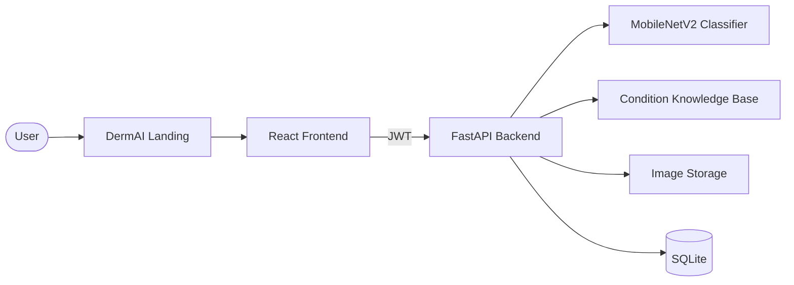

# DermAI — Skin Health Screening

Free, full-stack AI skin health screening. Upload a skin image, get instant classification across 5 conditions, and receive educational health insights — completely free.

> **Disclaimer:** DermAI is for educational awareness only. It is not a substitute for professional medical diagnosis.

---

## Quick Start (Windows)

```cmd
setup_and_start.bat
```

## Quick Start (Linux / Mac)

```bash
chmod +x setup_and_start.sh
./setup_and_start.sh
```

This will:
1. Generate a secure `SECRET_KEY` for JWT tokens
2. Install Python backend dependencies
3. Install Node.js frontend dependencies
4. Start FastAPI backend on `http://localhost:8000`
5. Start React frontend on `http://localhost:5173`

Open **http://localhost:5173** → create an account → upload a skin image.

---

## Architecture



### Tech Stack

| Component | Technology |
|-----------|------------|
| Frontend | React 18, Vite, React Router |
| Backend | FastAPI, JWT auth, bcrypt |
| Database | SQLite |
| ML Model | TensorFlow MobileNetV2 |
| Insights | Curated JSON knowledge base |
| Storage | Filesystem (`backend/uploads/`) |

---

## Supported Conditions

1. Acne
2. Benign skin growths
3. Eczema
4. Fungal infections
5. Melanoma

---

## Manual Setup

**1. Create `.env` from example:**
```bash
cp .env.example .env
```

**2. Backend:**
```bash
cd backend
pip install -r requirements.txt
uvicorn app.main:app --reload --host 0.0.0.0 --port 8000
```

**3. Frontend:**
```bash
cd frontend
npm install
npm run dev
```

Ensure model files exist at `model/models/skin_model.h5` and `class_indices.json`.

---

## Features

- User registration and JWT authentication
- Drag-and-drop image upload with validation
- AI classification with confidence scores
- Risk assessment (low / medium / high urgency)
- Educational health insights per condition
- Scan history with saved image thumbnails
- Downloadable text report (free, no libraries)
- Public landing page

---

## Project Highlights

- **Fully self-contained:** All inference and insights run without external API dependencies
- **Production-ready:** Auth, history, insights, reports — a complete application
- **Privacy-first:** Images and data stay on your own server

---

## License

MIT License
